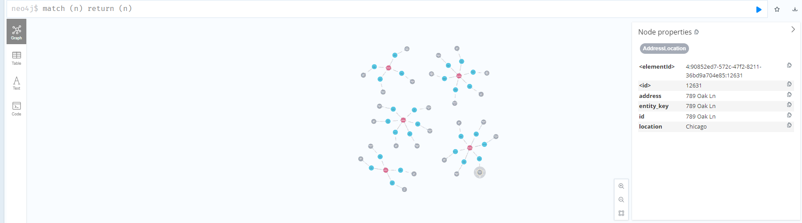
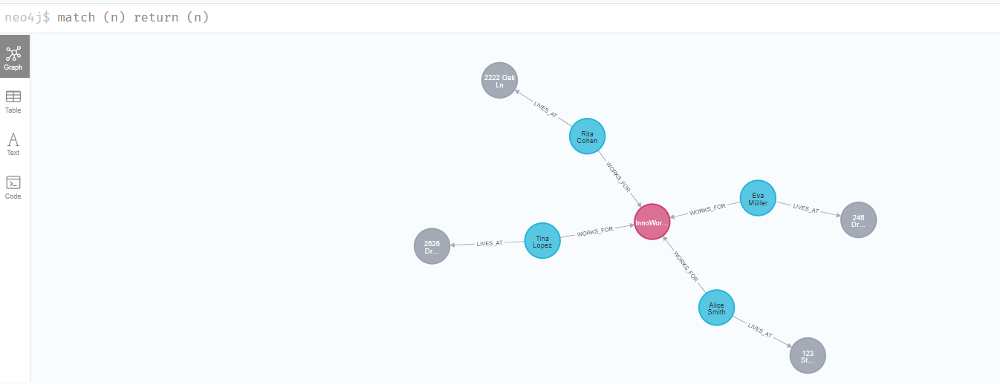

# CSV to Neo4j Knowledge Graph Extraction

A Python script that automatically converts structured data (CSV/Excel files) into Neo4j knowledge graphs using large language models. Transforms structured tabular data into rich, interconnected graph databases with intelligent entity and relationship detection. This script transforms structured data into rich, queryable knowledge graphs that reveal hidden patterns and relationships in your data dynamically using LLMs. The automation of knowledge graph generation using LLM allows users not familiar with Cypher Query work with knowledge graphs. Currently the script clears the database first before parsing and adding the structured data into the database.

## Table of Contents

1. [Overview](#overview)
2. [Key Features](#key-features)
3. [Quick Start](#quick-start)
   - [Requirements](#requirements)
   - [Usage](#usage)
4. [How It Works](#how-it-works)
   - [Smart Data Loading](#phase-1-smart-data-loading)
   - [LLM-Powered Schema Extraction](#phase-2-llm-powered-schema-extraction)
   - [Graph Construction](#phase-3-graph-construction)
   - [Neo4j Integration](#phase-4-neo4j-integration)
5. [Core Data Models](#core-data-models)
   - [Schema Structure](#schema-structure)
   - [Graph Output](#graph-output)
6. [Key Points](#key-points)
   - [Smart Entity Detection](#smart-entity-detection)
   - [Cross-Reference Discovery](#cross-reference-discovery)
   - [Entity Deduplication](#entity-deduplication)
7. [Example Workflow](#example-workflow)
8. [Limitations and concerns](#limitations-and-concerns)
9. [Data Preparation](#data-preparation)
10. [Limitations and Future Iterations](#limitations-and-future-iterations)



## Overview

This tool analyzes tabular data and automatically:
- **Identifies entities and relationships** within your data using LLM intelligence
- **Creates logical graph schemas** by understanding data structure and patterns  
- **Detects cross-references** between entities (e.g., "Person A knows Person B")
- **Builds Neo4j knowledge graphs** with proper entity deduplication
- **Handles complex relationship mappings** across different rows and tables



## Key Features

- **Schema Extraction through LLM**: Uses LLM to analyze data structure and suggest optimal entity-relationship models
- **Cross-Reference Detection**: Automatically finds columns that reference other entities
- **Entity Deduplication**: Ensures unique entities across the entire dataset
- **Relationship Discovery**: Creates both same-row and cross-row relationships
- **Constraint Management**: Automatically creates Neo4j constraints for data integrity
- **Batch Processing**: Handles large datasets efficiently

## Quick Start

### Requirements

Create a `.env` file:

```env
NEO4J_URI=bolt://localhost:7687
NEO4J_USERNAME=neo4j
NEO4J_PASSWORD=<your_password>
NEO4J_DATABASE=neo4j
MODEL_PATH=<path_to_your_llm_model>
```
If you are connecting via Aura DB, Add this import:
`pip install graphdatascience`
Then add the following into the script 
`from graphdatascience import GraphDataScience`
and change your .env file as follows:
```
AURA_CONNECTION_URI = "neo4j+s://xxxxxxxx.databases.neo4j.io"
AURA_USERNAME = "neo4j"
AURA_PASSWORD = "..."

# Client instantiation
gds = GraphDataScience(
    AURA_CONNECTION_URI,
    auth=(AURA_USERNAME, AURA_PASSWORD),
    aura_ds=True
)
```

**Note**: 
Currently configured for Neo4j Desktop. For Neo4j Aura DB, update the URI and install `pip install graphdatascience`. For reference, https://neo4j.com/docs/aura/classic/aurads/connecting/python/

### Usage

**Command Line:**
```bash
python3 neo4j_graph.py your_data.csv --batch-size 2000
```

**Programmatic:**
```python
from script import process_file
process_file("your_data.csv", batch_size=2000)
```

## How It Works

The system follows the following pipeline:

```
CSV/Excel data → Data Analysis → LLM Schema → Graph Build → Neo4j Storage
```

### Phase 1: Smart Data Loading
- **File Detection**: Automatically handles CSV and Excel formats
- **Quality Filtering**: Removes columns with >50% missing values
- **Data Profiling**: Analyzes column types, uniqueness, and patterns

### Phase 2: LLM-Powered Schema Extraction
- **Intelligent Analysis**: LLM examines your data structure and suggests entities
- **Relationship Discovery**: Identifies logical connections between different data elements
- **Key Column Detection**: Automatically finds the best unique identifiers
- **Schema Validation**: Ensures extracted schema matches your actual data

### Phase 3: Graph Construction
- **Entity Creation**: Builds unique entities across all rows with smart deduplication
- **Reference Detection**: Finds columns that reference other entities (like "Manager" pointing to other employees)
- **Relationship Mapping**: Creates two types of relationships:
  - **Same-row relationships**: Connections within a single record
  - **Cross-row relationships**: References between different records

### Phase 4: Neo4j Integration
- **Database Preparation**: Clears existing data and creates constraints
- **Batch Processing**: Efficiently uploads nodes and relationships
- **Performance Optimization**: Uses MERGE operations to handle duplicates

## Core Data Models

### Schema Structure
The LLM generates a structured schema containing:
- **Entities**: Main concepts in your data (Person, Company, Product)
- **Relationships**: How entities connect (WORKS_FOR, KNOWS, LOCATED_IN)
- **Column Mappings**: Which columns belong to which entities
- **Key Columns**: Best unique identifiers for each entity
- **Confidence Score**: How well the data fits a graph structure

### Graph Output
The final graph contains:
- **Nodes**: Unique entities with properties from your original data
- **Relationships**: Typed connections between entities
- **Metadata**: Processing statistics and quality metrics

## Key Algorithms

### Smart Entity Detection
The system identifies entities by:
1. Analyzing column patterns and data types
2. Looking for high-uniqueness columns as potential keys
3. Grouping related attributes together logically
4. Ensuring each entity represents a meaningful real-world concept

### Cross-Reference Discovery
Automatically detects reference columns by:
1. Comparing column values with entity identifiers
2. Calculating overlap ratios between columns
3. Identifying columns with >40% matches to entity keys
4. Converting column names to relationship types

### Entity Deduplication
Uses an intelligent EntityStore that:
1. Creates unique keys combining entity type and identifier
2. Merges additional properties when entities already exist
3. Ensures the same person/company/item appears only once
4. Maintains referential integrity across the entire dataset

## Example Workflow

Given a CSV with employee data:
```
Name,Company,Role,Manager,Location
Alice,TechCorp,Engineer,Bob,NYC
Bob,TechCorp,Manager,,NYC
Carol,DataInc,Analyst,David,LA
```

### LLM Schema Extraction
The system should by and large identifies:
- **Entities**: Person, Company, Location
- **Relationships**: WORKS_FOR, MANAGES, LOCATED_IN
- **Key Columns**: Name for Person, Company for Company
- **Reference Detection**: "Manager" column references other Person entities

***Note***
As it is fully generated by LLM, the results varies upon each run of the script.

### Graph Result
- **3 Person nodes**: Alice, Bob, Carol
- **2 Company nodes**: TechCorp, DataInc  
- **2 Location nodes**: NYC, LA
- **Relationships**: Alice-[WORKS_FOR]->TechCorp, Bob-[MANAGES]->Alice, etc.

## Limitations and concerns
### Quality Assurance
- **Schema Validation**: Ensures column mappings match actual data
- **Relationship Verification**: Validates entity references exist
- **Confidence Scoring**: Provides metrics for extracted schemas

## Data Preparation
- Use meaningful column names that clearly indicate content
- Ensure consistent naming conventions across your dataset
- Include identifier columns where possible (IDs, names, codes) ***Very Important***
- Handle missing values appropriately before processing

## Limitations and Future Iterations
- Currently does not allow for user input/checks to ensure entities and relationships generated from the LLM are accurate
- Limit the scope of data such that the schema can be predefined
- Fine tuning of model to improve accuracy
- Integrate to allow LLMs to create Cypher queries as well
